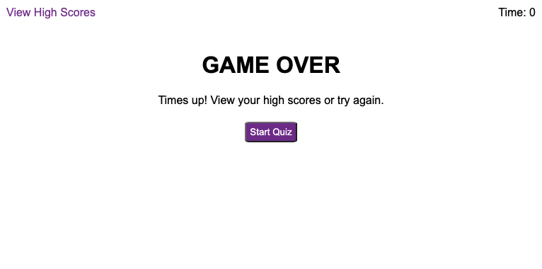

# JavaScript Code Quiz

A timed, multiple-choice JavaScript fundamentals quiz that stores high scores.

To beat the clock, users must correctly answer all questions--each incorrect answer loses them 5 seconds! Winners can store their initials and view a list of high scores before playing again. With a simple and responsive design, the quiz is easy to expand with additional questions and an adjusted timer value.

## User Story

GIVEN the user is taking a JavaScript code quiz  
WHEN the user clicks the start quiz button  
THEN a timer starts counting down and they are presented with a multiple choice question

WHEN the user correctly answers a question  
THEN they are presented with another question

WHEN the user incorrectly answers a question  
THEN 5 seconds are deducted from the timer

WHEN the timer reaches 0  
THEN the user is presented with the Game Over display

WHEN all questions have been answered correctly  
THEN the user is presented with a form to submit their initials and score

WHEN the user submits their initials  
THEN they are presented the list of their high scores

WHEN the user clicks the Clear High Scores button  
THEN the scores displayed on the page and the local storage are cleared

WHEN the user clicks the Go Back button  
THEN they are taken to the starting page

## Deployed Application

[GitHub Pages](https://kayleriegerpatton.github.io/javascript-code-quiz/)

## Screenshots

### Start Page:

### Question Display:

### Game Over:

### Win Display

### High Scores:

